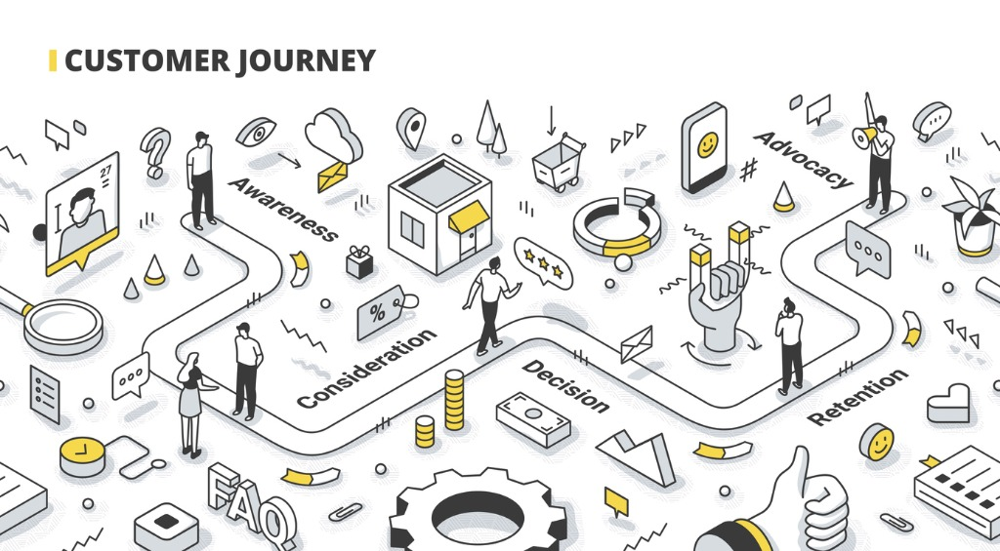

<!--StartFragment-->

According to Google, the traditional digital marketing funnel doesn’t work — at least, not anymore. Instead of following a linear path towards purchasing a product or service, users are taking unique, one-of-a-kind journeys.

<!--StartFragment-->

If your business wants to succeed, it’s time to adopt the online marketing funnel of today.

<!--StartFragment-->

A digital marketing funnel describes the steps that users take to move from being a prospect to a customer. While there are multiple marketing funnels, most include stages focused on awareness, consideration, purchase, and retention. Businesses can use any funnel to guide their marketing efforts.

<!--StartFragment-->

Whether you’re familiar or unfamiliar with the previous digital marketing funnel, it’s worth reviewing how the two compare. That way, your team can see how you need to adapt your strategy to meet current user behaviors.

For reference, the old marketing funnel (often called the AIDA model) includes these four stages:

1. **Awareness:** A person knows your product or service exists.
2. **Interest:** A person expresses interest in your product or service.
3. **Desire:** A person wants your product or service.
4. **Action:** A person purchases your product or service.

<!--StartFragment-->

Learning and adopting a digital marketing funnel can help your business in several ways, including:

* Discover the strategies, like content marketing, that will help your audience the most
* Understand the motivations that drive your target audience to research and purchase
* Realize why specific strategies, like downloadable content, only work at certain stages
* Uncover how and when to nurture relationships with leads and current customers
* Build an effective plan for marketing to users at different stages of the funnel

When you take the time to research the marketing funnel, as well as your buyer journey, you can improve your marketing strategy. Instead of guessing what your audience wants, you can use your data to build a data-backed campaign for attracting and nurturing new and existing customers.

<!--EndFragment-->

<!--EndFragment-->

<!--EndFragment-->

<!--EndFragment-->

<!--EndFragment-->